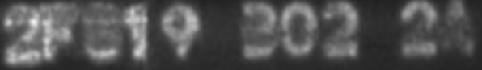
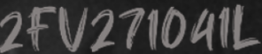

中鋼人工智慧挑戰賽-字元辨識
===

# Data
## Introduction
* Data Statistic
    * train Data Size: 12,067
    * valid Data Size: 6,037
    * test Data Size: 6,000
* Note
    * data including
        * single bounding box (with 4 points)
        * recognition results
    * data preview
    
        
       
    * special noise
        * double vision
        
            
        * vertical line
        
             
             
        * hand write
        
             
            
             
             
        * incomplete letters
        
             
             
        * noise
        
            
## Metric
* Score function
    * function
    
        
        
    * code
    ```
    import numpy as np
    from Levenshtein import distance

    def metric_loss(true_txt,pred_txt):
        if true_txt==pred_txt:
            return [0, 0]
        pred_txt = pred_txt if pred_txt else ''
        max_dist = max(len(true_txt),len(pred_txt))
        loss2 = distance(true_txt,pred_txt) / max_dist
        return [1,loss2]

    def mix_score(result):
        '''
        input: 
            [{'label':'abcd','predict':'abc'},....]
        '''
        res = [metric_loss(ele['label'],ele['predict']) for ele in result]
        term1 = np.sum([x[0] for x in res])
        term2 = np.mean([x[1] for x in res])
        return term1+term2
    ```

## Process
* Generate fake data
    * Prepare
        * background
        * font
    * Recognition part
        * Step 1
            * mix background and word (package: [trdg](https://github.com/Belval/TextRecognitionDataGenerator))
            * Example 1
            
                
                
            * Example 2
                
                 
        * Step 2
            * add noise
                * noise feature
                    * rotate 180
                    * double vision
                    * vertical line
                    * hand write
            * Example
                * Example 1 (double vision)
                
                   
                  
                * Example 2 (csc font)
                
                   
                  
    * detection part
        * Step 1
            * Hollowing out the bounding box for the original figure.
        * Step 2
            * Fill in the fake image of the recognition task to detect the background image.
            * Example
                * Example 1
                
                  
                  
                * Example 2
                
                  

# Modeling
## Framework
* [PaddleOCR](https://github.com/PaddlePaddle/PaddleOCR)
## Workflow


## Trainning Step
* Since the original dataset lacks information on angle classification, each image is flipped during training. 

### Detection Model
* Find the area where the target text is located.
* Valid metric: [hmean](https://www.twblogs.net/a/5d3f5ea7bd9eee5174228ec5)
* Text detection algorithm performance
    * ICDAR2015 dataset (Reference from [PaddleOCR](https://github.com/PaddlePaddle/PaddleOCR/blob/release/2.3/doc/doc_en/algorithm_overview_en.md))
        |Model|Backbone|precision|recall|Hmean|
        | --- | --- | --- | --- | --- | 
        |EAST|ResNet50_vd|85.80%|86.71%|86.25%
        |EAST|MobileNetV3|79.42%|80.64%|80.03%|
        |DB|ResNet50_vd|86.41%|78.72%|82.38%|
        |DB|MobileNetV3|77.29%|73.08%|75.12%|
        |SAST|ResNet50_vd|91.39%|83.77%|87.42%|
    * **CSC** dataset
        |Model|Backbone|validation hmean|
        | --- | --- |  --- |
        |EAST|ResNet50_vd|98.74%|
        |DB  |MobileNetV3|98.83%|
        |SAST|ResNet50_vd|96.19%|
* Problem & Solution
    * Issue Figure
        * Figure 1 
        
            
            
            * Problem
                * Multiple bounding box - uncorrect
        * Figure 2
        
            
            
            * Problem
                * Multiple bounding box - correct
    * Solution
        * Solution 1 : merge all bounding box 
        
            
            
            * Problem: Oversized bounding box
        * Solution 2 : check if each border has characters then merge
        
            
            
        * Solution 3 : Find the y-axis coordinates located at the lower part of the picture and estimate the reasonable y-axis range. 
            
            

## Recognition Model
* Image augmentation
    * Padding original figure
        * Sometimes the bounding box will be less than the mark a character. (maybe labeling problem)
    * data relabeling
        * After training a robust model, the valid dataset is compared to the prediction, and the data with excessive conf differences are re-labeled.
* Text recognition algorithm performance 
    * Public datasets (Reference from [PaddleOCR](https://github.com/PaddlePaddle/PaddleOCR/blob/release/2.3/doc/doc_en/algorithm_overview_en.md))
    
        |Model  | 	Backbone	| Acc	|
        |-------|---------------|-------|
        |Rosetta| 	Resnet34_vd	|80.90%	|
        |Rosetta| 	MobileNetV3	|78.05%	|
        |CRNN	| Resnet34_vd	|82.76%	|
        |CRNN	| MobileNetV3	|79.97%	|
        |StarNet| 	Resnet34_vd	|84.44%	|
        |StarNet| 	MobileNetV3	|81.42%	|
        |RARE	| MobileNetV3	|82.50%	|
        |RARE	| Resnet34_vd	|83.60%	|
        |SRN	| Resnet50_vd_fpn	|88.50%|
        |NRTR	| NRTR_MTB	    | 84.30%	|
    * **CSC** dataset
    
        | DET Model|REC Model|trainning set| Method|Valid score|Test score| 
        |---------------|------------------| ----------- | -------- |-----| ----|
        |MobileNeV3-DB|MobileNetV3-CRNN | Orig        |M1        | 318 | 183 |
        |MobileNeV3-DB|MobileNetV3-CRNN | Orig+Fake1  |M1        | 291 | 175 |
        |MobileNeV3-DB|MobileNetV3-CRNN | Orig+Fake1  |M2+E2     | 248 | 127 |
        |MobileNeV3-DB|MobileNetV3-CRNN | Orig+Fake1  |M2+E4     | 239 | 124 |
        |MobileNeV3-DB|Resnet50_fpn+SRN | Orig+Fake1  |M2        | 237 | 118 |
        |MobileNeV3-DB|Resnet50_fpn+SRN | Orig+Fake1  |M2+E2     | 210 | 103 |
        |MobileNeV3-DB|Resnet50_fpn+SRN | Orig+Fake1,2|M2+pad2+E2| 194 |  75 |
        |MobileNeV3-DB|Resnet50_fpn+SRN\*2 | Orig+Fake1,2|M2+pad2+E6  | 187 |  72 |
        |MobileNeV3-DB + Resnet50-EAST|Resnet50_fpn+SRN\*2 | Orig+Fake1,2|M2+pad0,1+E6| 165 |  56 |
        |MobileNeV3-DB + Resnet50-EAST|Resnet50_fpn+SRN\*3 | Orig+Fake1,2+test|M2+pad0,1+E6| 151 | 44 |
        
        * dataset representation
            * Orig  : CSC train dataset
            * valid : CSC valid dataset
            * test  : CSC test dataset
            * Fake 1: fake dataset version 1
            * Fake 2: fake dataset version 2
        * dependent detection model method representation
            * M1 : choose maximum recognition confidence result from each bounding box
            * M2 : merge all bounding box
            * pad{k}: padding bounding box with size k from original figure
            * E{k} : Take k combinations of recognition results  from original, rotate 180, brightness, contrast, sharpen and blur.

# Prediction
## End2end Prediction
* Detection predict module 1 
    * pipeline
    
       
       
    * Pros
        * Using different models can complement the advantages of prediction.
            * MobileNetV3 + DB: The prediction region is a bit sensitive and more susceptible to noise.
            * Resnet50-EAST: More stable results, but has the problem of lower recall.
    * Cons
        * Oversized bounding box and low confidence of recognition results.
* Detection predict module 2
    * Pipeline
    
       
       
    * Pros
        * Using different models can complement the advantages of prediction.
        * Fix `Detection module 1` oversized bounding box problem.
        * Enhance the confidence of recognition results.
    * Cons
        * Cost too much time
    * Sample
    
         

* Image augmentation
    * Pipeline
    
         
         
    * Pros
        * Enhance the confidence of recognition results.
    * Cons
        * Need to find good combination.
        * May lead to overfitting problem.
    * Sample
        * Original
        
           
           
        * Rotate 180
           
           
           
        * Blur
        
            
            
        * Contrast
        
            
            
* Recognition predict module
    * Pipeline
    
      
      
    * Pros
        * Enhance the confidence of recognition results.
    * Cons
        * Using different models can complement the advantages of prediction.
        * Need to find good combination.
        * May lead to overfitting problem.
    * Sample
      ```
      'pad0_orig':     [('1WG762012F', 0.99999964)]
      'pad0_force180': [('1WG762012F', 0.9999987)]
      'pad0_blur':     [('1WG762012F', 0.9999994)]
      'pad0_contrast': [('1WG762012F', 0.9999997)]
      'pad1_orig':     [('1WG762012F', 0.9999997)]
      'pad1_force180': [('1WG762012F', 0.9999978)]
      'pad1_blur':     [('1WG762012F', 0.99999875)]
      'pad1_contrast': [('1WG762012F', 0.9999997)]
      'pad2_orig':     [('1WG762012F', 0.9999997)]
      'pad2_force180': [('1WG762012F', 0.99999774)]
      'pad2_blur':     [('1WG762012F', 0.9999958)]
      'pad2_contrast': [('1WG762012F', 0.99999964)]
      ```
